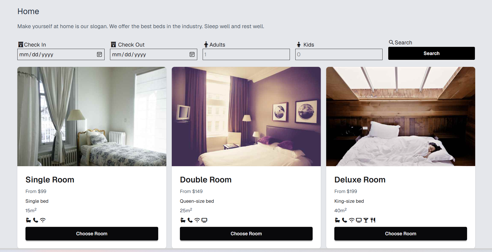

<div align="center">

# 🏨 LUXESTAY HOTEL

### Modern Luxury Hotel Landing Page



<br>

[](https://sumaiya7-ops.github.io/Hotel-Template/)
[](https://github.com/sumaiya7-ops/Hotel-Template)
[]
[]

</div>

---

# 🌟 Overview

**Luxestay Hotel** is a modern and elegant hotel landing page designed to deliver a premium luxury experience through clean layouts, smooth visual hierarchy, and responsive user interface design.

The project focuses on:
- modern hotel branding
- elegant typography
- luxury-inspired color palette
- responsive layouts
- smooth user experience

---

# ✨ Features

🏨 Luxury Hotel Landing Page  
🎨 Elegant Modern UI Design  
📱 Fully Responsive Layout  
🌌 Fullscreen Hero Section  
⚡ Smooth Hover Animations  
🧊 Clean Card Components  
🖼️ Beautiful Hotel Imagery  
🧭 Modern Navigation Bar  
💎 Premium Spacing & Layout System  
📞 Professional Footer Section  

---

# 🛠️ Technologies Used

| Technology | Purpose |
|---|---|
| HTML5 | Website Structure |
| CSS3 | Styling & Animations |
| Flexbox | Responsive Layout |
| CSS Grid | Grid System |
| Google Fonts | Typography |
| Font Awesome | Icons |

---

# 📸 Website Sections

## 🧭 Hero Section
Elegant hotel banner with luxury visuals and call-to-action buttons.

## 🏨 Rooms & Services
Modern room showcase with clean card-based layouts.

## 🌟 About Hotel
Professional content section introducing hotel services and experience.

## 📞 Contact & Footer
Clean footer with navigation and social media links.

---

# 📱 Responsive Design

Optimized for:

| Device | Status |
|---|---|
| Desktop 💻 | ✅ Fully Optimized |
| Tablet 📱 | ✅ Responsive |
| Mobile 📲 | ✅ Mobile-Friendly |

---

# 🎨 Design Philosophy

The website follows a clean and luxury-focused design style based on:

- minimalism
- elegant spacing
- visual balance
- modern typography
- premium aesthetics
- user-friendly layout

---

# 📂 Project Structure

```bash
Hotel-Template/
│
├── index.html
├── style.css
├── README.md
├── preview.png
│
├── assets/
│   ├── images/
│   ├── icons/
│   └── backgrounds/
```

---

# 🚀 Future Improvements

- 🌙 Dark / Light Mode
- ✨ Scroll Reveal Animations
- 📩 Booking Form Functionality
- 🧠 JavaScript Interactions
- 🎥 Advanced UI Animations
- 🌐 Backend Integration
- 📅 Room Booking System

---

# 👩‍💻 Author

<div align="center">

## Sumaiya

Frontend Developer • Creative UI Designer

Passionate about building elegant, responsive, and visually engaging web experiences.

</div>

---

# 🌟 Support

If you like this project:

⭐ Give this repository a star  
🍴 Fork the project  
📢 Share your feedback  

---

# 📜 License

This project is created for educational and practice purposes only.

---

<div align="center">

### 💜 Thanks for Visiting Luxestay Hotel

</div>
